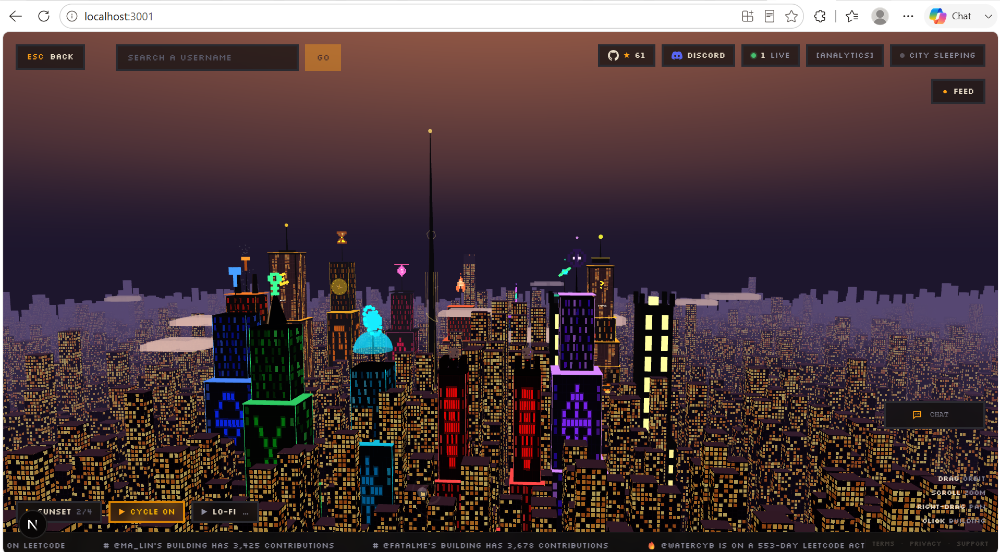
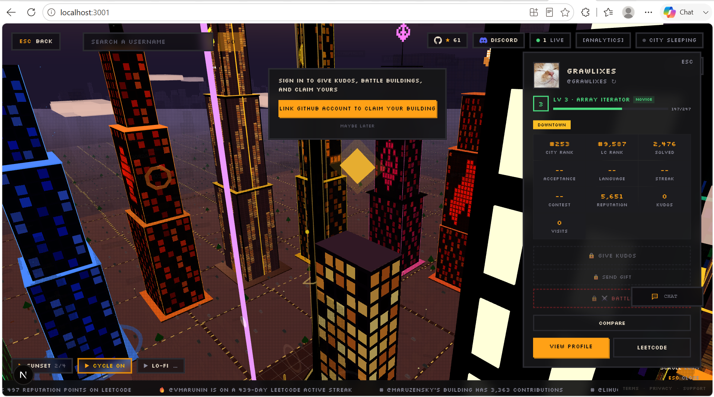
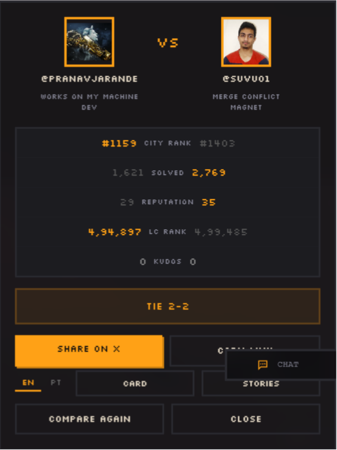

<h1 align="center">LeetCode City</h1>

<p align="center">
  <strong>Your LeetCode profile as a 3D pixel art building in an interactive city.</strong>
</p>

<p align="center">
  <a href="https://theleetcode.city">theleetcode.city</a>
</p>

<p align="center">
  
</p>

<p align="center">
  <a href="https://www.npmjs.com/package/leetcode-city"></a>
  <a href="https://github.com/Ixotic27/The-Leetcode-City/stargazers"></a>
  <a href="https://github.com/Ixotic27/The-Leetcode-City/issues"></a>
  <a href="https://github.com/Ixotic27/The-Leetcode-City/blob/main/LICENSE"></a>
</p>

---

## Screenshots

<p align="center">
  
  <br /><em>The 3D pixel-art city — every developer's LeetCode profile becomes a building</em>
</p>

<p align="center">
  
  
  <br /><em>Developer profile cards (left) and head-to-head comparison (right)</em>
</p>

---

## Table of Contents 

- <a href="#what-is-leetcode-city">What is LeetCode City?</a>
- <a href="#features">Features</a>
- <a href="#how-buildings-work">How Buildings Work</a>
- <a href="#architecture--rendering-flow">Architecture & Rendering Flow</a>
- <a href="#leetcode-data-pipeline">LeetCode Data Pipeline</a>
- <a href="#the-journey-of-a-single-developer">The Journey of a Single Developer</a>
- <a href="#data-source">Data Source</a>
- <a href="#data-collection-pipeline">Data Collection Pipeline</a>
- <a href="#rate-limiting--reliability">Rate Limiting & Reliability</a>
- <a href="#database-layer">Database Layer</a>
- <a href="#building-generation">Building Generation</a>
- <a href="#city-rendering">City Rendering</a>
- <a href="#-key-files">📁 Key Files</a>
- <a href="#tech-stack">Tech Stack</a>
- <a href="#-getting-started">🚀 Getting Started</a>
- <a href="#-environment-variables">🔧 Environment Variables</a>
- <a href="#-contributing">🤝 Contributing</a>
- <a href="#-contributors">👥 Contributors</a>
- <a href="#license">License</a>

---

## What is LeetCode City?

LeetCode City transforms every LeetCode profile into a unique pixel art building. The more you solve, the taller your building grows. Explore an interactive 3D city, fly between buildings, and discover developers from around the world.

## Features

- **3D Pixel Art Buildings** — Each LeetCode user becomes a building with height based on submissions, width based on skill levels, and lit windows representing activity
- **Free Flight Mode** — Fly through the city with smooth camera controls, visit any building, and explore the skyline
- **The Arena** — Challenge others, climb the leaderboard, and unlock legendary items and titles
- **Profile Pages** — Dedicated pages for each developer with stats, achievements, and top solved problems
- **Achievement System** — Unlock achievements based on submissions, points, and more
- **Building Customization** — Claim your building and customize it with items from the shop (crowns, auras, roof effects, face decorations, custom titles)
- **Social Features** — Send kudos, gift items to other developers, refer friends, and see a live activity feed
- **Compare Mode** — Put two developers side by side and compare their buildings and stats
- **Share Cards** — Download shareable image cards of your profile in landscape or stories format

## How Buildings Work

| Metric         | Affects           | Example                                |
|----------------|-------------------|----------------------------------------|
| Submissions    | Building height   | 1,000 solved → taller building         |
| Active Days    | Building width    | More active days → wider base          |
| Points         | Window brightness | More points → more lit windows         |
| Recent Activity| Window pattern    | Recent solve → distinct glow pattern   |

Buildings are rendered with instanced meshes and a LOD (Level of Detail) system for performance. Close buildings show full detail with animated windows; distant buildings use simplified geometry.

## Architecture & Rendering Flow

### Data Flow Overview

```
Supabase (developers table)
        │
        â–¼
generateCityLayout()          ← src/lib/github.ts
  ├── calcHeightV2/calcHeight    (submissions → height)
  ├── calcWidthV2/calcWidth      (active days → width)
  ├── calcDepthV2/calcDepth      (streak → depth)
  ├── calcLitPercentageV2        (recent activity → window glow)
  └── block-grid placement       (position every building on the map)
        │
        â–¼
CityBuilding[]                ← passed from page.tsx to CityCanvas
        │
        â–¼
CityCanvas (Three.js scene)   ← src/components/CityCanvas.tsx
  ├── Building3D (per building)  ← src/components/Building3D.tsx
  ├── InstancedMesh decorations  (trees, cars, lamps, benches…)
  └── Sky, river, bridges, ads
        │
        â–¼
GPU — single frame
```

### Building Generation (`src/lib/github.ts`)

Two generation pipelines run inside `generateCityLayout()`:

- **V2 pipeline** — for LC-claimed buildings (`isV2Dev`). Uses `calcHeightV2`, `calcWidthV2`, `calcDepthV2`, and `calcLitPercentageV2`, which map LeetCode-native stats (easy/medium/hard solved counts, contest rating, app streak) to visual dimensions.
- **Legacy pipeline** — for unclaimed/GitHub-only buildings. Uses `calcHeight`, `calcWidth`, and `calcDepth`, which map GitHub contribution count, stars, and repo count.

Both pipelines feed into a shared block-grid placer: buildings are arranged into city blocks separated by streets and alleys, with district zones (`districtZones`) grouping them by tech stack.

### Window Texture Atlas (`src/components/Building3D.tsx`)

All building windows share a single **2048×2048 canvas texture** generated once at startup. It contains 6 lit-percentage bands (20%, 35%, 50%, 65%, 80%, 95%), each 42 rows tall and 256 columns wide, with 8px cells (6px window + 2px gap). Each building samples a UV region from its matching band — one texture, zero per-building allocation, one draw call for all windows across the entire city.

### Instanced Mesh Optimization (`src/components/CityCanvas.tsx`)

City decorations are rendered as `THREE.InstancedMesh` — one GPU draw call per geometry type regardless of how many instances exist in the scene:

| Mesh type | Instances |
|-----------|-----------|
| Tree trunks & canopies | All trees in the city |
| Lamp poles & lights | All street lamps |
| Car bodies & cabins | All parked cars |
| Benches, fountain parts | All plaza furniture |
| Sidewalk tiles | All pavement |
| Collectibles (fly mode) | Up to 40 coins |

Building bodies are handled individually in `Building3D.tsx` since each needs a unique size, color, and effect set.

### LOD System (`src/components/Building3D.tsx`)

Buildings switch detail level based on camera distance, computed per frame:

- **Near** — full window texture, neon outlines, particle auras, billboard images, and all cosmetic effect layers
- **Far** — simplified geometry, no texture sampling, no effect layers

This keeps frame rate stable regardless of city size — adding more buildings only affects the far-LOD bucket, which has near-zero per-building GPU cost.

##  LeetCode Data Pipeline

LeetCode City transforms real LeetCode activity into a fully rendered 3D city. This section explains how developer data is discovered, processed, stored, and ultimately converted into buildings.

---

##  The Journey of a Single Developer

Imagine a LeetCode user with the following profile:

| Metric | Value |
|----------|----------|
| Problems Solved | 1200 |
| Contest Rating | 1850 |
| Active Days | 310 |
| Current Streak | 97 Days |

Before appearing in the city, that profile travels through the entire data pipeline:

```text
LeetCode Profile
       │
       â–¼
LeetCode GraphQL API
       │
       â–¼
Seeder Scripts
       │
       â–¼
Supabase Database
       │
       â–¼
generateCityLayout()
       │
       â–¼
CityBuilding Object
       │
       â–¼
Three.js Renderer
       │
       â–¼
3D Building in LeetCode City
```

By the time rendering occurs, the raw profile data has been transformed into a complete building with its own dimensions, lighting, activity effects, and district placement.

---

##  Data Source

Developer statistics are fetched directly from the LeetCode GraphQL API.

The application retrieves:

| Data | Purpose |
|--------|----------|
| Easy / Medium / Hard solved counts | Building generation |
| Contest rating | Building dimensions |
| Submission history | Activity analysis |
| Active days | Lighting calculations |
| Streak information | Activity effects |
| Reputation & ranking | Progression metrics |

### Primary Files

```text
scripts/seed-lc.ts
scripts/seed-lc-mass.ts
scripts/seed-lc-infinite.ts
src/lib/leetcode.ts
```

---

##  Data Collection Pipeline

The city is populated using automated seeding scripts that continuously discover real LeetCode users.

### Step 1 - Discover Users

The seeder queries LeetCode's global ranking pages:

```text
Global Ranking Page
        │
        â–¼
Extract Usernames
```

### Step 2 - Fetch Detailed Statistics

For each username, the system requests richer profile data:

```text
Username
      │
      â–¼
GraphQL Profile Query
      │
      â–¼
Solved Counts
Contest Rating
Submission Calendar
Activity Data
```

### Step 3 - Normalize & Store

Fetched statistics are transformed into a common format and written into Supabase.

```text
Raw API Response
        │
        â–¼
Normalize Fields
        │
        â–¼
Upsert Into
developers Table
```

Using an upsert operation ensures:

- Existing developers are updated
- New developers are inserted automatically
- Duplicate records are avoided

---

##  Rate Limiting & Reliability

Because the project relies on public LeetCode APIs, requests are intentionally throttled.

| Strategy | Purpose |
|------------|-----------|
| 1 second delay between profiles | Reduce API pressure |
| 2 second delay between ranking pages | Prevent bursts |
| Retry & backoff logic | Recover from temporary failures |
| State persistence | Resume long imports |
| Snapshot generation | Reduce runtime work |

### Infinite Seeder Recovery

`seed-lc-infinite.ts` stores progress in a local state file:

```text
seed-lc-state.json
```

If the process stops unexpectedly, the next run resumes from the last processed ranking page instead of starting over.

---

##  Database Layer

Processed developer records are stored in the Supabase `developers` table.

Important LeetCode-related fields include:

```text
easy_solved
medium_solved
hard_solved
contest_rating
acceptance_rate
lc_streak
active_days_last_year
lc_global_rank
```

These fields later become inputs for city generation.

---

##  Building Generation

After data is loaded from Supabase, `generateCityLayout()` transforms developer records into renderable city objects.

```text
Developer Record
        │
        â–¼
Height Calculation
        │
        â–¼
Width Calculation
        │
        â–¼
Depth Calculation
        │
        â–¼
Lighting Calculation
        │
        â–¼
CityBuilding
```

### How LeetCode Stats Affect Buildings

| LeetCode Metric | Visual Result |
|-----------------|---------------|
| Total Problems Solved | Building Height |
| Active Days | Building Width |
| Contest Rating | Building Depth |
| Submission Activity | Window Lighting |
| Streak Length | Activity Effects |
| Easy / Medium / Hard Distribution | Window Patterns |

A building is not randomly generated. Every visual characteristic originates from real LeetCode activity.

---

##  City Rendering

Client pages first attempt to load a pre-generated city snapshot.

```text
Snapshot Available?
        │
   ┌────┴────┐
   │         │
 Yes         No
   │         │
   â–¼         â–¼
Load     Chunked API
Snapshot  Requests
```

Once developer records are available:

```text
Developer Data
       │
       â–¼
generateCityLayout()
       │
       â–¼
Buildings
Plazas
Decorations
Districts
River
Bridges
       │
       â–¼
CityCanvas
       │
       â–¼
Three.js Scene
```

The final output is the interactive city visible throughout the application.

---

## 📁 Key Files

| File | Responsibility |
|---------|----------------|
| `scripts/seed-lc.ts` | Initial seeding |
| `scripts/seed-lc-mass.ts` | Bulk imports |
| `scripts/seed-lc-infinite.ts` | Continuous expansion |
| `src/lib/leetcode.ts` | LeetCode utility functions |
| `src/lib/github.ts` | Building generation pipeline |
| `src/app/wallpaper/page.tsx` | Snapshot & city loading |
| `src/components/CityCanvas.tsx` | Three.js rendering |

## Tech Stack

- **Framework:** [Next.js](https://nextjs.org) 16 (App Router, Turbopack)
- **3D Engine:** [Three.js](https://threejs.org) via [@react-three/fiber](https://github.com/pmndrs/react-three-fiber) + [drei](https://github.com/pmndrs/drei)
- **Database & Auth:** [Supabase](https://supabase.com) (PostgreSQL, GitHub OAuth, Row Level Security)
- **Payments:** [Stripe](https://stripe.com)
- **Styling:** [Tailwind CSS](https://tailwindcss.com) v4 with pixel font (Silkscreen)
- **Hosting:** [Vercel](https://vercel.com)
- **CI/CD:** GitHub Actions with automated PR review (Copilot), labeling, and security scans

---

## 🚀 Getting Started

### Option 1: One-Command Setup (Recommended)

```bash
npx leetcode-city init
cd The-Leetcode-City
npm run dev
```

That's it. **No API keys needed** for frontend development. The public keys are pre-filled.

### Option 2: Manual Setup

```bash
# Clone the repo
git clone https://github.com/Ixotic27/The-Leetcode-City.git
cd The-Leetcode-City

# Automated setup (installs deps + creates .env.local)
npm run setup

# Start dev server
npm run dev
```

### Option 3: Full Manual

```bash
git clone https://github.com/Ixotic27/The-Leetcode-City.git
cd The-Leetcode-City
npm install
cp .env.example .env.local
npm run dev
```

Open [http://localhost:3001](http://localhost:3001) to see the city.

---

## 🔧 Environment Variables

The `.env.example` file comes **pre-filled with public read-only keys** so you can start developing immediately. No extra configuration needed for frontend work.

| Variable | Pre-filled? | Needed For |
|----------|:-----------:|------------|
| `NEXT_PUBLIC_SUPABASE_URL` | ✅ | Everything (public key) |
| `NEXT_PUBLIC_SUPABASE_ANON_KEY` | ✅ | Everything (public key) |
| `SUPABASE_SERVICE_ROLE_KEY` | ❌ | Auth, writes, API routes |
| `GITHUB_TOKEN` | ❌ | GitHub API integration |
| `STRIPE_SECRET_KEY` | ❌ | Payment features only |
| `RESEND_API_KEY` | ❌ | Email notifications only |
| `NOWPAYMENTS_API_KEY` | ❌ | Crypto payments only |

### What works without secret keys?

| ✅ Works out of the box | ⚠️ Needs service role key |
|------------------------|--------------------------|
| View the 3D city | Sign in / auth |
| Browse developer profiles | Claiming buildings |
| UI/CSS/component changes | Shop purchases |
| 3D rendering & animations | Raids & interactions |
| Leaderboard & search | API route writes |

> **Need full access?** contact me on [LinkedIn](https://www.linkedin.com/in/ishant-singh-bisht-247a4b322/) for the service role key.

---

## 🎮 E.Arcade Multiplayer (Supabase Realtime)

LeetCode City features a live multiplayer overworld town (**E.Arcade**) powered by **Supabase Realtime**. This setup uses Broadcast for low-latency player movement and chat synchronization, and Presence for active user tracking.

For detailed setup instructions (applying migrations and enabling realtime replication on your database), please refer to the [Multiplayer Setup Guide in CONTRIBUTING.md](CONTRIBUTING.md#earcade-multiplayer-supabase-realtime-setup).

---

## 🤝 Contributing

> **🎉 NEW: Zero-Config Contribution Workflow!**
> We've just made contributing 10x easier. You no longer need to set up any API keys to work on the UI, 3D scenes, or styling. Just run `npx leetcode-city init` and start coding immediately! See [Getting Started](CONTRIBUTING.md) for details.

Please see our comprehensive [Contributing Guide](CONTRIBUTING.md) for full details on:
- 🚀 How to set up the project (Zero-config)
- 📝 Assignment rules and PR guidelines
- 🏷️ Our label system and automated reviews
- 🏆 GSSoC 2026 Scoring and information

---

## 👥 Contributors

Thanks to all contributors ❤️

[](https://github.com/Ixotic27/The-Leetcode-City/graphs/contributors)

<!-- toc update fix -->

---

## License

[AGPL-3.0](LICENSE) — You can use and modify LeetCode City, but any public deployment must share the source code.

---

<p align="center">
  Original creator <a href="https://github.com/Ixotic27">@Ixotic27</a>
</p>
<p align="center">
  Inspired by <a href="https://github.com/srizzon/git-city">Git City</a>
</p>

